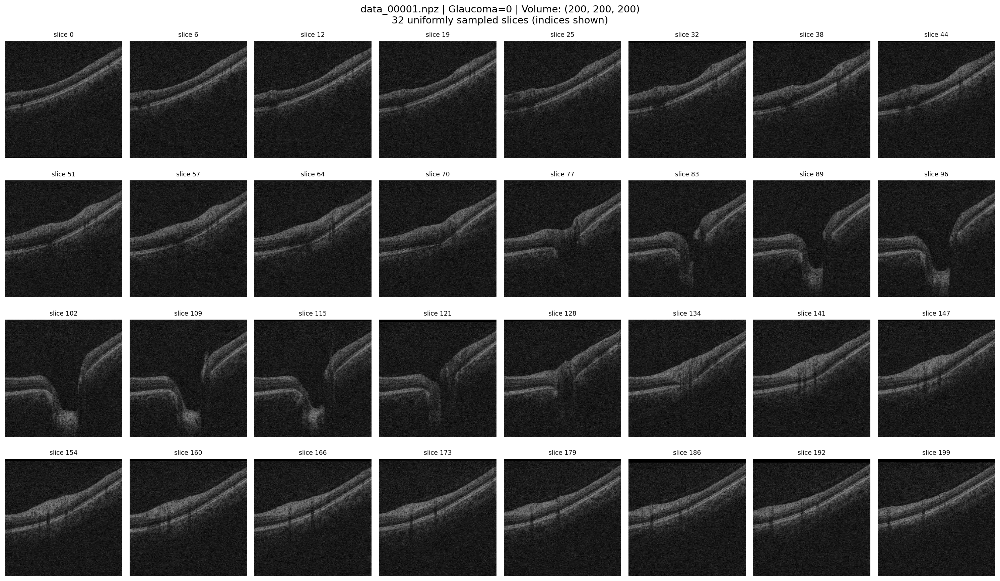

# SLIViT for Glaucoma Classification on FairVision OCT Data

Reproducing the [SLIViT](https://github.com/cozygene/SLIViT) architecture for binary glaucoma classification on [Harvard FairVision](https://github.com/Harvard-Ophthalmology-AI-Lab/FairVision) OCT data.

## Background

### How SLIViT works

SLIViT classifies 3D medical volumes without a full 3D CNN by slicing the volume into 2D images and processing them in stages:

**Stage 1: ConvNeXt-Tiny (feature extractor).** A 2D CNN that processes each OCT slice independently to extract spatial features (retinal layer boundaries, thickness patterns, etc). Pretrained on ImageNet, then on the [Kermany OCT dataset](https://data.mendeley.com/datasets/rscbjbr9sj/2) (84K retinal OCT images: CNV, DME, drusen, normal).

**Stage 2: ViT (integrator).** A Vision Transformer that takes per-slice features from ConvNeXt and learns cross-slice relationships. Randomly initialized.

**Stage 3: Classification head.** `LayerNorm + Linear(256, 1)`, outputs a single logit.

### Why start with a frozen feature extractor?

The ConvNeXt already knows OCT from Kermany pretraining, so freezing it and only training the ViT+head is cheaper and safer. This capped at ~0.83 AUC because glaucoma has its own patterns (RNFL thinning, optic nerve changes) that the frozen features can't capture. Unfreezing for Phase 2 pushed test AUC to 0.87.

### The dataset

Glaucoma subset of [Harvard FairVision](https://github.com/Harvard-Ophthalmology-AI-Lab/FairVision):
- 10,000 subjects, each with a 200x200x200 OCT volume (`.npz`)
- Binary labels: glaucoma (1) or not (0)
- Pre-split: 6,000 train / 1,000 val / 3,000 test
- Includes demographic info (race, gender, ethnicity) for fairness research

~63GB compressed, available on [HuggingFace](https://huggingface.co/datasets/ming0100/Harvard_FairVision) (`dataset-004.zip`).

## Architecture details

```
OCT Volume (200x200x200)
  -> Sample N slices uniformly (we tested 32, 64, 100)
  -> Resize each to 256x256, convert grayscale to 3-channel
  -> Tile vertically into one tall image: 3 x (Nx256) x 256
  -> ConvNeXt-Tiny (ImageNet -> Kermany OCT pretrained)
  -> N feature maps of 768x64 each
  -> Linear projection: 49152-d -> 256-d per token
  -> ViT encoder (5 layers, 20 heads, dim_head=64, mlp_dim=512)
  -> CLS token -> LayerNorm -> Linear(256, 1) -> logit
```

Total: 77.8M params (27.8M ConvNeXt, 50M ViT + projections + head).

Since `vit_dim=256` doesn't divide evenly by 20 heads, each transformer block needs projection layers (256 to 1280 and back), accounting for ~33M of the 50M trainable params. Switching to 16 heads would eliminate these and drop trainable params to ~15M.

## Results

### Phase 1: Frozen feature extractor, train ViT + head only

| Run | Slices | LR (vit / head) | Dropout | Eff Batch | Val AUC | Test AUC | Best Epoch |
|-----|--------|-----------------|---------|-----------|---------|----------|------------|
| 1 | 32 | 5e-5 / 5e-5 | 0.0 | 16 | 0.831 | N/A | 6 |
| 2 | 32 | 2e-5 / 1e-4 | 0.0 | 16 | 0.832 | N/A | 6 |

### Phase 2: Full fine-tuning, all parameters trainable

| Run | Slices | LR (fe / vit / head) | Dropout | Batch/GPU | Accum | Eff Batch | Val AUC | Test AUC | Best Epoch |
|-----|--------|----------------------|---------|-----------|-------|-----------|---------|----------|------------|
| 3 | 32 | 5e-6 / 1e-5 / 5e-5 | 0.10 | 2 | N/A | 8 | 0.846 | **0.869** | 4 |
| 4 | 64 | 1e-6 / 5e-6 / 5e-5 | 0.15 | 1 | N/A | 4 | 0.841 | 0.868 | 6 |
| 5 | 64 | 1e-6 / 5e-6 / 5e-5 | 0.15 | 2 | 2 | 16 | 0.845 | 0.866 | 9 |
| 6 | 32 | 1e-6 / 5e-6 / 5e-5 | 0.15 | 2 | 2 | 16 | 0.840 | 0.864 | 7 |

## What we tried and why

### Phase 1 experiments (Runs 1-2)

Started with SLIViT defaults, frozen ConvNeXt. Run 1 used a single LR (5e-5) and hit 0.831 val AUC. Run 2 split the LR (head 1e-4, ViT 2e-5) with no meaningful improvement (0.832). The bottleneck was the frozen features, not the learning rate.

### Moving to full fine-tuning (Run 3)

Unfroze the ConvNeXt with a low LR (5e-6) to preserve the Kermany pretrained weights, ViT at 1e-5, head at 5e-5. Added dropout (0.1) for the now-78M parameter model. Best result: 0.846 val / **0.869 test AUC**.

### More slices and lower LR (Run 4)

Tried 64 slices for denser coverage. Dropped LRs (ConvNeXt 1e-6, ViT 5e-6) and bumped dropout to 0.15 to combat overfitting. Had to reduce batch to 1/GPU due to VRAM. Result: 0.868 test AUC, essentially the same as 32 slices, but the comparison is confounded by multiple simultaneous changes.

### Fixing the batch size confound (Runs 5-6)

Used gradient accumulation (2 steps) with bs=2/GPU for an effective batch of 16. Ran 32 and 64 slices with identical hyperparameters. Results: 0.866 vs 0.864, a negligible difference. **32 slices is enough.**

### Best run was our first Phase 2 attempt

Run 3's higher LRs reached a better optimum faster despite earlier overfitting (best epoch 4 vs 7-9). Early stopping captured the peak, making the aggressive LR worthwhile.

### The overfitting problem

Every run follows the same pattern: val loss starts climbing after epoch 4-6. By end of training, train loss ~0.04 vs val loss >1.0. Dropout, lower LRs, and per-component LRs all helped marginally but didn't solve it. The root cause is likely 50M trainable params on only 6K images, with 33M of those in projection layers that could be eliminated by using 16 heads.

## Training setup

**Hardware:** 4x NVIDIA T4 (16GB each)

**Timing:**
- 32 slices, bs=2/GPU: ~5 min/epoch, ~1 hour per run
- 64 slices, bs=1/GPU: ~24 min/epoch, 4-5 hours per run

**Stack:** PyTorch 1.13.1, CUDA 11.7, HuggingFace Transformers, 4-GPU DDP with fp16.

**Training config:**
- AdamW, weight decay 0.01
- Cosine LR with 3-epoch warmup
- BCEWithLogitsLoss
- Early stopping on val AUC, patience=5
- ConvNeXt from [SLIViT's checkpoint](https://drive.google.com/drive/folders/1f8P3g8ofBTWMFiuNS8vc01s98HyS7oRT)

## Project structure

```
src/
  model.py           SLIViT model (ConvNeXt + ViT + head)
  dataset.py         Loads FairVision .npz files, samples and tiles slices
  train.py           Training loop with DDP, gradient accumulation, test eval
  eval_test.py       Standalone test set evaluation from a saved checkpoint
  setup_data.py      Downloads data from cloud storage to compute node
  upload_results.py  Pushes results back to cloud storage after training
  run.sh             Entry point for training jobs
  run_eval.sh        Entry point for evaluation jobs

configs/
  phase1_32.yml      Phase 1, 32 slices
  phase1_64.yml      Phase 1, 64 slices
  phase2_32.yml      Phase 2, 32 slices
  phase2_64.yml      Phase 2, 64 slices
  phase2_128.yml     Phase 2, 100 slices
  environment.yml    Conda environment

scripts/
  download_hf.py     Downloads the dataset from HuggingFace
```

## What's next

Things that could push past the 0.87 ceiling:

- **16 attention heads instead of 20**: eliminates projection layers, drops trainable params from 50M to ~15M
- **Data augmentation**: random flips, intensity jitter, random slice offsets (we used none)
- **Label smoothing**: soft targets (0.05/0.95) to prevent overconfidence
- **Fairness analysis**: per-group AUC using the demographic metadata

## References

- Avram et al., "SLIViT: a general AI framework for clinical-feature diagnosis from limited 3D biomedical-imaging data" ([paper](https://pubmed.ncbi.nlm.nih.gov/38045283/), [code](https://github.com/cozygene/SLIViT))
- Luo et al., "Harvard Ophthalmology AI-Lab FairVision Dataset" ([paper](https://arxiv.org/abs/2310.02492), [code](https://github.com/Harvard-Ophthalmology-AI-Lab/FairVision))
- Liu et al., "A ConvNet for the 2020s" ([paper](https://arxiv.org/abs/2201.03545))

## Sample

32 uniformly sampled B-scans from one OCT volume (non-glaucoma):


