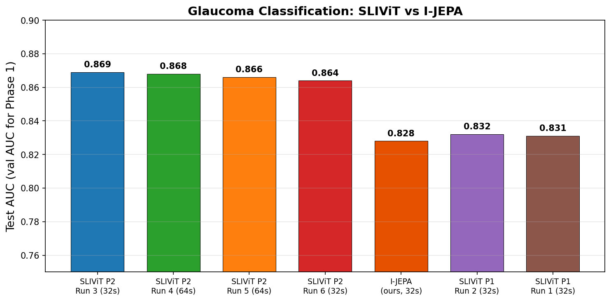
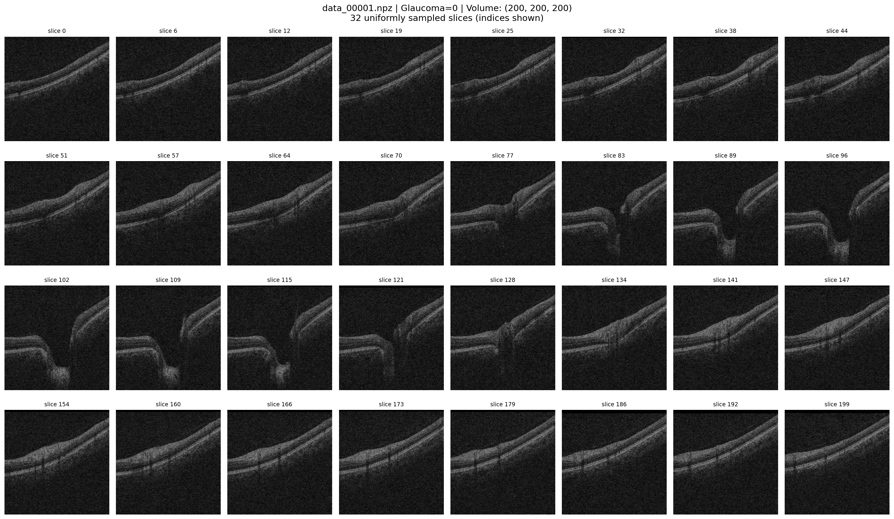
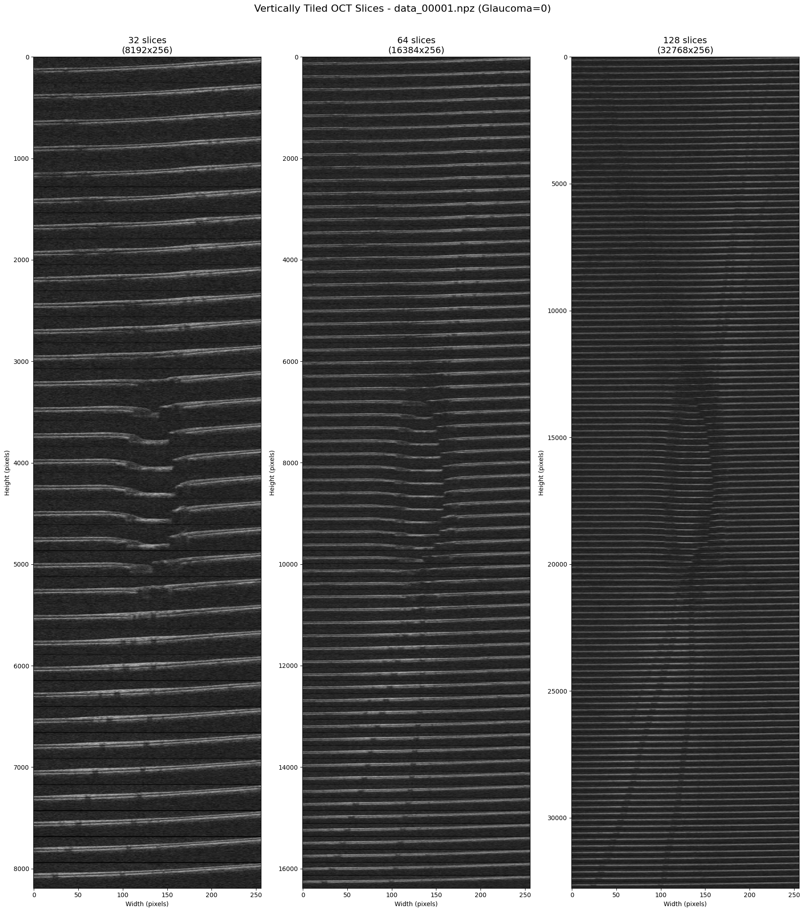

# SLIViT for Glaucoma Classification on FairVision OCT Data

Reproducing the [SLIViT](https://github.com/cozygene/SLIViT) architecture for binary glaucoma classification on [Harvard FairVision](https://github.com/Harvard-Ophthalmology-AI-Lab/FairVision) OCT data.

## Results Summary

| Method | Slices | LR config | Dropout | Eff Batch | Test AUC |
|--------|--------|-----------|---------|-----------|----------|
| **SLIViT Phase 2, Run 3** | **32** | **5e-6 / 1e-5 / 5e-5** | **0.10** | **8** | **0.869** |
| SLIViT Phase 2, Run 4 | 64 | 1e-6 / 5e-6 / 5e-5 | 0.15 | 4 | 0.868 |
| SLIViT Phase 2, Run 5 | 64 | 1e-6 / 5e-6 / 5e-5 | 0.15 | 16 | 0.866 |
| SLIViT Phase 2, Run 6 | 32 | 1e-6 / 5e-6 / 5e-5 | 0.15 | 16 | 0.864 |
| SLIViT Phase 1, Run 2 | 32 | 2e-5 / 1e-4 (vit/head) | 0.0 | 16 | N/A (val 0.832) |
| SLIViT Phase 1, Run 1 | 32 | 5e-5 / 5e-5 (vit/head) | 0.0 | 16 | N/A (val 0.831) |
| *I-JEPA (ours)* | *32* | *—* | *—* | *—* | *0.828* |

*I-JEPA result from our [sibling project](https://github.com/yfeng0206/I-JEPA) using ViT-B/16 with ImageNet-initialized SSL pretraining + fine-tuning.*



## Key Findings

1. **Full fine-tuning is the key lever.** Unfreezing ConvNeXt pushed test AUC from ~0.83 (Phase 1) to 0.869 (Phase 2), confirming that Kermany-pretrained features alone are insufficient for glaucoma.

2. **32 slices is enough.** Controlled comparison (Runs 5 vs 6, identical hyperparameters): 64 slices gave 0.866 vs 32 slices at 0.864 — negligible difference at 5x the training cost.

3. **Higher LRs found a better optimum.** Run 3's aggressive LRs (5e-6/1e-5/5e-5) peaked early (epoch 4) but reached the best test AUC. Early stopping captured the sweet spot.

4. **Overfitting is the main bottleneck.** Train loss ~0.04 vs val loss >1.0 by end of training. Root cause: 50M trainable params on 6K images, with 33M in unnecessary projection layers.

5. **20-head projection waste.** `vit_dim=256` doesn't divide by 20 heads, forcing 256-to-1280 projections. Switching to 16 heads would cut trainable params from 50M to ~15M.

## Quick Links

| | |
|---|---|
| **Experiments** | [All experiments](docs/experiments) |
| **Phase 1** | [Frozen ConvNeXt experiments](docs/experiments/phase1) (2 runs) |
| **Phase 2** | [Full fine-tuning experiments](docs/experiments/phase2) (4 runs) |
| **Architecture** | [Model architecture details](docs/architecture.md) |

## Architecture

SLIViT classifies 3D OCT volumes without a 3D CNN by slicing the volume into 2D images and processing them in a pipeline:

1. **ConvNeXt-Tiny** (feature extractor) — processes each OCT slice independently. Pretrained on ImageNet, then on the Kermany OCT dataset (84K retinal OCT images).
2. **ViT** (integrator) — takes per-slice features and learns cross-slice relationships. 5 layers, 20 heads, dim 256.
3. **Classification head** — `LayerNorm + Linear(256, 1)`, outputs a single logit.

Total: 77.8M params (27.8M ConvNeXt, 50M ViT + projections + head). See [full architecture details](docs/architecture.md).

## Dataset

Glaucoma subset of [Harvard FairVision](https://github.com/Harvard-Ophthalmology-AI-Lab/FairVision):
- 10,000 subjects, each with a 200x200x200 OCT volume (`.npz`)
- Binary labels: glaucoma (1) or not (0)
- Pre-split: 6,000 train / 1,000 val / 3,000 test
- Includes demographic info (race, gender, ethnicity) for fairness research

~63GB compressed, available on [HuggingFace](https://huggingface.co/datasets/ming0100/Harvard_FairVision) (`dataset-004.zip`).

## Project Structure

```
src/
  model.py           SLIViT model (ConvNeXt + ViT + head)
  dataset.py         Loads FairVision .npz files, samples and tiles slices
  train.py           Training loop with DDP, gradient accumulation, test eval
  eval_test.py       Standalone test set evaluation from a saved checkpoint
  setup_data.py      Downloads data from cloud storage to compute node
  upload_results.py  Pushes results back to cloud storage after training
  run.sh             Entry point for training jobs
  run_eval.sh        Entry point for evaluation jobs

configs/
  phase1_32.yml      Phase 1, 32 slices
  phase1_64.yml      Phase 1, 64 slices
  phase2_32.yml      Phase 2, 32 slices
  phase2_64.yml      Phase 2, 64 slices
  phase2_128.yml     Phase 2, 100 slices
  environment.yml    Conda environment

scripts/
  download_hf.py     Downloads the dataset from HuggingFace

docs/
  architecture.md    Model architecture details
  experiments/       Detailed experiment logs & analysis
    phase1/          Frozen ConvNeXt experiments (Runs 1-2)
    phase2/          Full fine-tuning experiments (Runs 3-6)

results/             Training curves, plots, raw data
```

## What's Next

Things that could push past the 0.87 ceiling:

- **16 attention heads instead of 20**: eliminates projection layers, drops trainable params from 50M to ~15M
- **Data augmentation**: random flips, intensity jitter, random slice offsets (we used none)
- **Label smoothing**: soft targets (0.05/0.95) to prevent overconfidence
- **Fairness analysis**: per-group AUC using the demographic metadata

## References

- Avram et al., "SLIViT: a general AI framework for clinical-feature diagnosis from limited 3D biomedical-imaging data" ([paper](https://pubmed.ncbi.nlm.nih.gov/38045283/), [code](https://github.com/cozygene/SLIViT))
- Luo et al., "Harvard Ophthalmology AI-Lab FairVision Dataset" ([paper](https://arxiv.org/abs/2310.02492), [code](https://github.com/Harvard-Ophthalmology-AI-Lab/FairVision))
- Liu et al., "A ConvNet for the 2020s" ([paper](https://arxiv.org/abs/2201.03545))

## Sample

32 uniformly sampled B-scans from one OCT volume (non-glaucoma):



Vertically tiled input images at 32, 64, and 128 slices (what the model actually sees):


