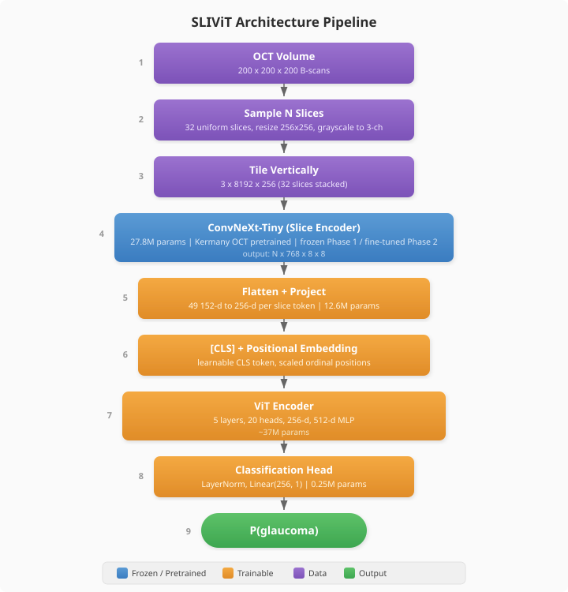

# SLIViT Architecture

SLIViT classifies 3D medical volumes without a full 3D CNN by slicing the volume into 2D images and processing them through a three-stage pipeline.



## Pipeline

```
OCT Volume (200x200x200)
  -> Sample N slices uniformly (we tested 32, 64, 100)
  -> Resize each to 256x256, convert grayscale to 3-channel
  -> Tile vertically into one tall image: 3 x (Nx256) x 256
  -> ConvNeXt-Tiny (ImageNet -> Kermany OCT pretrained)
  -> N feature maps of 768x64 each
  -> Linear projection: 49152-d -> 256-d per token
  -> ViT encoder (5 layers, 20 heads, dim_head=64, mlp_dim=512)
  -> CLS token -> LayerNorm -> Linear(256, 1) -> logit
```

## Components

| Component | Description | Parameters |
|-----------|-------------|------------|
| ConvNeXt-Tiny | 2D CNN feature extractor, pretrained on ImageNet then Kermany OCT (84K retinal images) | 27.8M |
| Linear projection | Maps flattened ConvNeXt features (49,152-d) to ViT token dimension (256-d) | 12.6M |
| ViT encoder | 5-layer transformer with 20 heads, dim 256, dim_head 64, MLP dim 512 | ~37M (incl. projections) |
| Classification head | LayerNorm + Linear(256, 1) | <1K |
| **Total** | | **77.8M** |

## Parameter Breakdown

- **ConvNeXt-Tiny:** 27.8M (frozen in Phase 1, trainable in Phase 2)
- **ViT + projections + head:** 50M trainable
  - Of this, approximately 33M are in attention projection layers
  - Remaining ~17M in embeddings, MLP blocks, layer norms, and the classification head

## The Projection Layer Issue

The ViT uses `vit_dim=256` with 20 attention heads. Since 256 does not divide evenly by 20, each transformer block requires projection layers to map from 256 to 1280 (= 20 x 64) and back. These projections account for ~33M of the 50M trainable parameters.

Switching to 16 heads would give `dim_head=16` (256/16=16), eliminating the need for these projections and dropping trainable parameters from 50M to approximately 15M. This would substantially reduce the overfitting risk for the 6K-image training set.

## Positional Embeddings

Each slice gets a scaled ordinal position encoding. For N slices uniformly sampled from a 200-slice volume, the position of slice i is:

```
position[i] = i * (200 / N)
```

This preserves the relative spacing between slices regardless of how many are sampled (e.g., 32 slices sample every ~6.25 positions, 64 slices every ~3.125).

## ConvNeXt Feature Extraction

Each 256x256 OCT slice is processed independently by ConvNeXt-Tiny, producing a feature map. For N slices, the tiled input is `3 x (Nx256) x 256`, and ConvNeXt outputs N feature maps of size 768x64. Each feature map is flattened to a 49,152-dimensional vector, then projected to 256 dimensions via a linear layer. This produces N tokens of dimension 256, which are fed to the ViT along with a prepended CLS token.

## Training Setup

| Setting | Value |
|---------|-------|
| Optimizer | AdamW |
| Weight decay | 0.01 |
| LR scheduler | Cosine with 3-epoch warmup |
| Loss | BCEWithLogitsLoss |
| Early stopping | On val AUC, patience=5 |
| Precision | fp16 (mixed precision) |
| Parallelism | 4-GPU DDP |
| ConvNeXt init | [SLIViT's Kermany checkpoint](https://drive.google.com/drive/folders/1f8P3g8ofBTWMFiuNS8vc01s98HyS7oRT) |

### Per-component learning rates (Phase 2)

| Component | Run 3 | Runs 4-6 |
|-----------|-------|----------|
| ConvNeXt (feature extractor) | 5e-6 | 1e-6 |
| ViT (integrator) | 1e-5 | 5e-6 |
| Head (classifier) | 5e-5 | 5e-5 |

The low ConvNeXt LR preserves pretrained weights while allowing gradual adaptation. The head gets the highest LR since it is randomly initialized.

## Memory Budget

| Config | Batch/GPU | VRAM per GPU | Time/Epoch |
|--------|-----------|-------------|------------|
| 32 slices | 2 | ~14GB | ~5 min |
| 64 slices | 1 | ~15GB | ~24 min |

Hardware: 4x NVIDIA T4 (16GB each). Stack: PyTorch 1.13.1, CUDA 11.7, HuggingFace Transformers.
